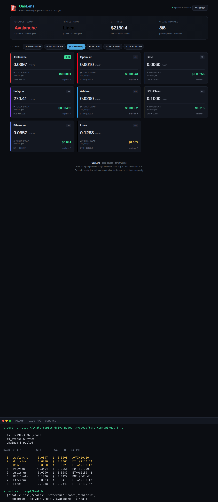

# ⛽ GasLens

**Real-time multi-chain gas price tracker for EVM networks.**

No login. No wallet. No API key. Just open and see live gas prices and USD costs across 8 chains.

🌐 Live demo: https://whale-topics-drive-modes.trycloudflare.com



---

## What it does

GasLens polls public RPC endpoints in parallel and shows:

- Current **gas price** (gwei) on every chain
- **USD cost estimate** for the 6 most common transaction types
- **Native token price** (ETH, BNB, AVAX, POL) live from CoinGecko
- **Cheapest vs priciest chain** at a glance
- Sorted by transaction cost — pick your tx type, see who's cheapest

## Why

Existing gas trackers focus on one chain at a time, require an account, or sell your data. GasLens is a single-page utility that anyone can use to answer one question fast:

> "Where should I do my next transaction?"

## Supported chains

| Chain     | Native | RPC                                       |
| --------- | ------ | ----------------------------------------- |
| Ethereum  | ETH    | `https://ethereum-rpc.publicnode.com`     |
| Base      | ETH    | `https://mainnet.base.org`                |
| Arbitrum  | ETH    | `https://arbitrum-one-rpc.publicnode.com` |
| Optimism  | ETH    | `https://optimism-rpc.publicnode.com`     |
| Polygon   | POL    | `https://polygon-bor-rpc.publicnode.com`  |
| BNB Chain | BNB    | `https://bsc-rpc.publicnode.com`          |
| Avalanche | AVAX   | `https://avalanche-c-chain-rpc.publicnode.com` |
| Linea     | ETH    | `https://linea-rpc.publicnode.com`        |

All RPCs are free and public. No keys needed.

## Tracked transaction types

| Type            | Typical gas units |
| --------------- | ----------------- |
| Native transfer | 21,000            |
| ERC-20 transfer | 65,000            |
| Token swap      | 200,000           |
| NFT mint        | 150,000           |
| NFT transfer    | 85,000            |
| Token approve   | 46,000            |

## Run locally

```bash
git clone https://github.com/asbestos22/gaslens.git
cd gaslens
pip install -r requirements.txt
uvicorn gaslens:app --host 0.0.0.0 --port 8004
```

Open http://localhost:8004

## API

GasLens exposes a small JSON API.

### `GET /api/health`

```json
{
  "status": "ok",
  "chains": ["ethereum", "base", "arbitrum", ...],
  "tx_types": ["transfer", "erc20", "swap", ...]
}
```

### `GET /api/gas`

```json
{
  "ts": 1779153345,
  "tx_types": { "swap": { "label": "Token swap", "gas": 200000, "icon": "⇄" }, ... },
  "chains": [
    {
      "id": "base",
      "name": "Base",
      "native": "ETH",
      "native_usd": 2134.25,
      "gas_gwei": 0.006,
      "base_fee_gwei": 0.001,
      "priority_gwei": 0.005,
      "cost_usd": {
        "transfer": 0.000269,
        "erc20": 0.000832,
        "swap": 0.002562,
        "nft_mint": 0.001921,
        "nft_xfer": 0.001088,
        "approve": 0.000589
      },
      "color": "#0052ff",
      "explorer": "https://basescan.org"
    }
  ]
}
```

Response is cached server-side for 5 seconds to stay polite to the public RPCs.

## Architecture

```
Browser ──HTTPS──> Cloudflare Tunnel ──> uvicorn :8004 ──> FastAPI
                                                              │
                                              ┌───────────────┴──────────────┐
                                              ▼                              ▼
                                ThreadPoolExecutor (8 RPCs)       httpx (CoinGecko)
                                              │                              │
                                              ▼                              ▼
                                     web3.py eth.gas_price          USD price feed
```

- **Backend:** FastAPI + uvicorn
- **RPC:** web3.py with 8s timeout per chain, 8-thread pool
- **Prices:** CoinGecko free `/simple/price` endpoint, async via httpx
- **Frontend:** vanilla HTML/CSS/JS, single file, ~13 KB
- **Caching:** 5-second in-memory TTL on the aggregated payload
- **Tunnel:** cloudflared quick tunnel (HTTPS, no account needed)

## Stack

- Python 3.10+
- FastAPI
- uvicorn
- web3.py 6.x
- httpx
- eth-abi (transitive)

## License

MIT — do whatever you want.

## Disclaimer

Gas units are typical estimates for common contract interactions. Actual gas use depends on the specific contract, calldata size, and storage writes. The numbers here are good for **comparing chains**, not for budgeting an exact transaction.
